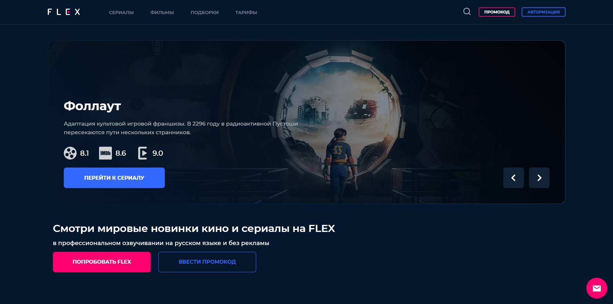
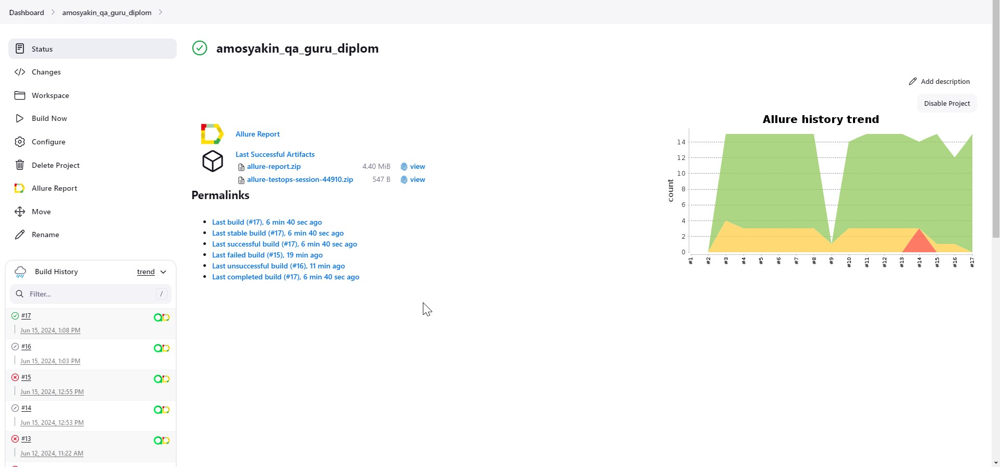
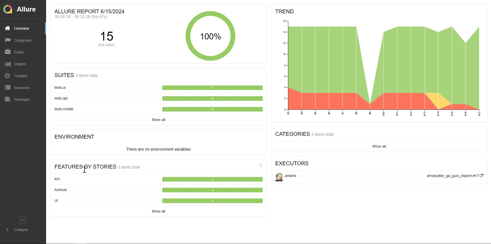
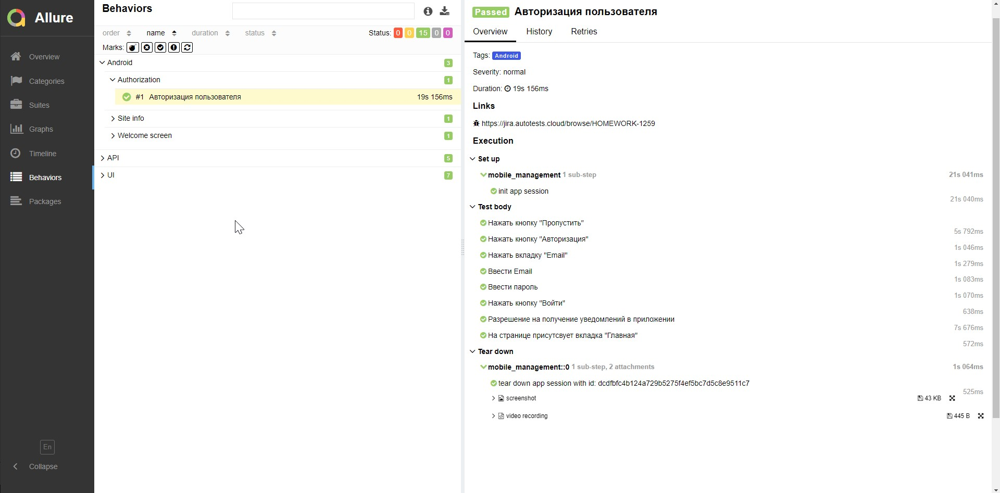
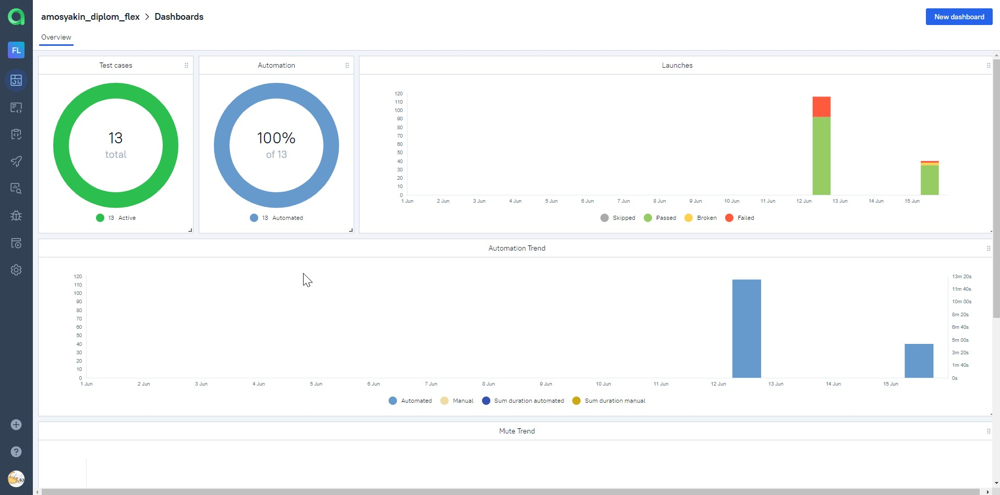
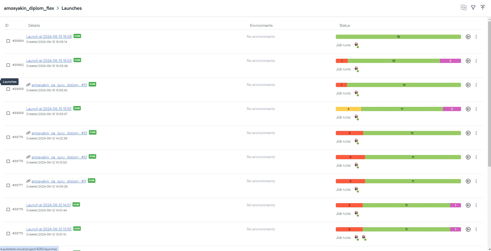
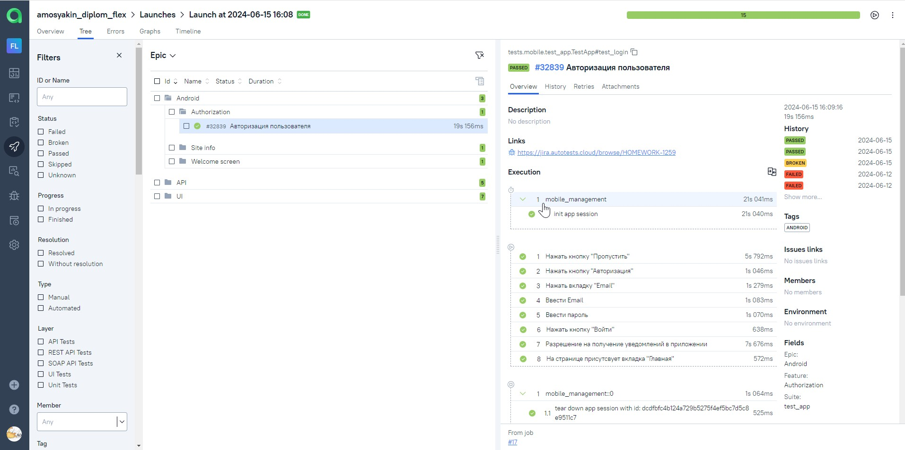
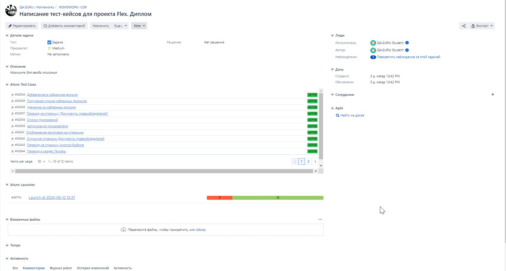
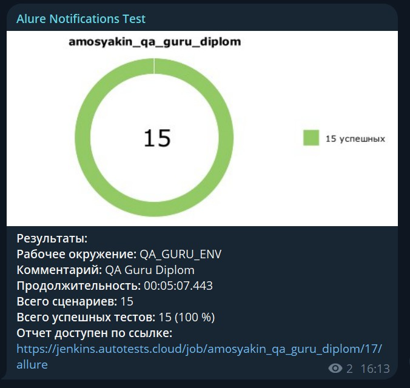
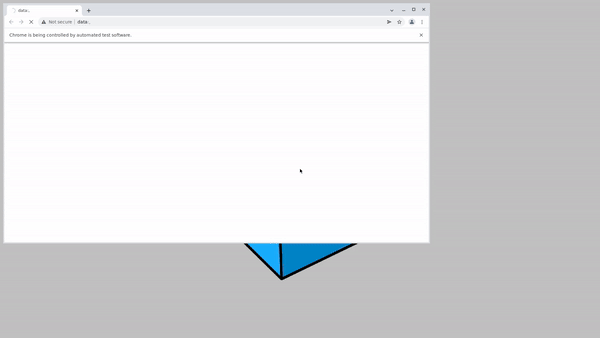

# Автотесты для веб-сайта онлайн-кинотеатра Flex

> https://flex-kino.com

## FLEX WEB

## FLEX Android App

## Особенности проекта
- Автотесты на WEB UI, API и Android App
  - Автотесты WEB UI запускаются через Selenoid
  - Автотесты Android App через BrowserStack или с помощью локального эмулятора
- Сборка проекта в Jenkins
- Отчеты Allure Report
- Интеграция с Allure TestOps
- Оповещения о тестовых прогонах в Telegram
- Отчеты с видео, скриншотом, логами, исходной моделью разметки страницы
- Автоматизация отчетности о тестовых прогонах и тест-кейсах в Jira

## Список релизованных проверок:
- WEB UI
  - Переход по разделам в Хэдэре:
    - Сериалы
    - Фильмы
    - Подборки
    - Тарифы
  - Поиск контента
  - Переход в ссылкам в футере:
    - Документы правообладателей
    - Страница RuStore для Anroid-приложения
- API
  - Авторизация пользователя
  - Раздел Избранное
    - Добавление в избранное
    - Получение списка избранных фильмов
    - Удаление из избранного
  - Получение информации о приложениях
- Android App
  - Авторизация в приложении
  - Проверка Welcome screen
  - Открытие в браузере страницы Документы правообладателей

## Используемый стэк
            

## Запуск тестов из терминала
### Для запуска всех автотестов выполнить в cli:
> python -m venv .venv  
> source .venv/bin/activate   
> pip install -r requirements.txt   
> pytest -s -v

### Получение отчета allure:
> allure serve allure-results

## Проект в Jenkins
> [Jenkins](https://jenkins.autotests.cloud/job/amosyakin_qa_guru_diplom_tests/)

### Запуск автотестов в Jenkins:
1. Открыть [проект](https://jenkins.autotests.cloud/job/amosyakin_qa_guru_diplom_tests/)

2. Нажать кнопку "Build Now"

## Allure отчет
### [Общие результаты](https://jenkins.autotests.cloud/job/amosyakin_qa_guru_diplom_tests/17/allure/)

### [Результат прохождения теста](https://jenkins.autotests.cloud/job/amosyakin_qa_guru_diplom_tests/17/allure/#behaviors)

## Интеграция с Allure TestOps
> [Allure TestOps](https://allure.autotests.cloud/project/4283/dashboards)

### [Дашбоард](https://allure.autotests.cloud/project/4283/dashboards)

### [История запусков тестовых наборов](https://allure.autotests.cloud/project/4283/launches)

### [Отображение тест кейса](https://allure.autotests.cloud/launch/39864/tree/645711?treeId=8398)

## Интеграция с Jira
### [Ссылка на проект](https://jira.autotests.cloud/browse/HOMEWORK-1259)

## Оповещения в Telegram

## Пример прохождения автотестов WEB UI

## Пример прохождения автотестов Android App

